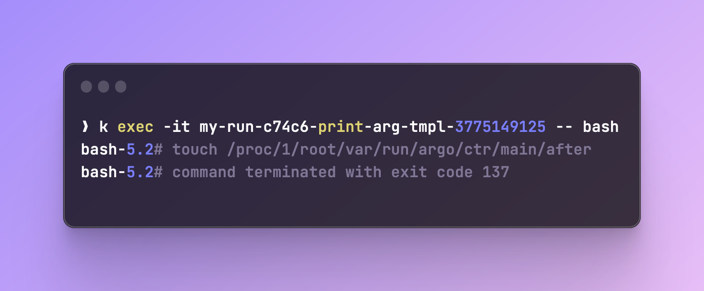
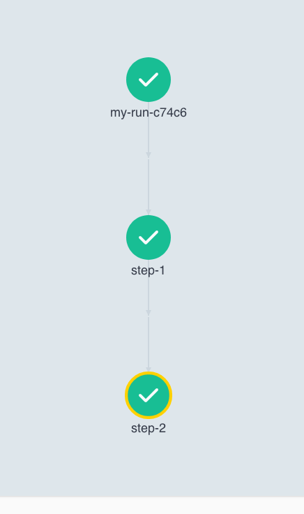
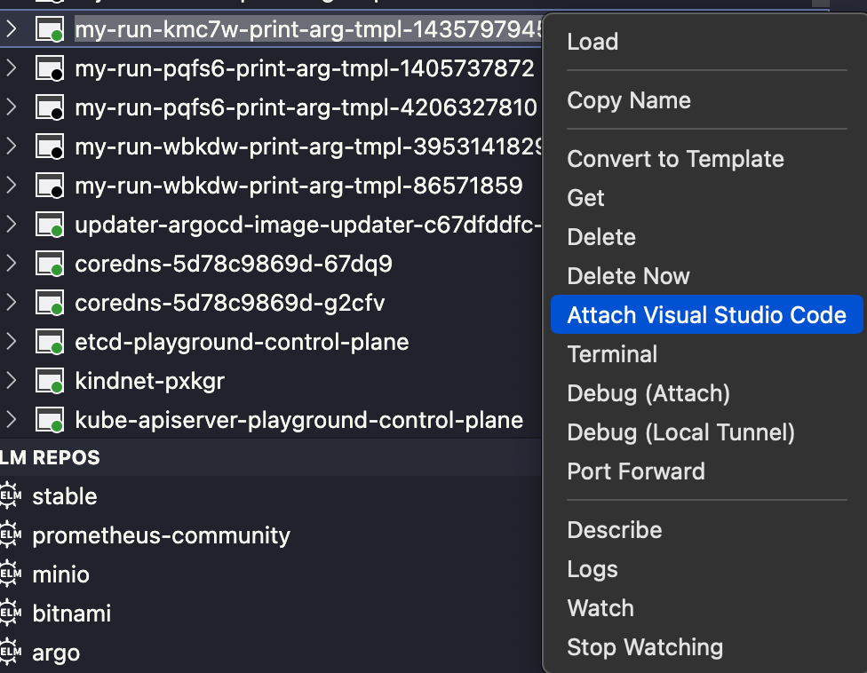

# Easily Debug Argo Workflows
Argo Workflows has a great feature that allows you to pause a certain step, and since each step runs in its own pod, it makes it simple to simply connect to that pod to troubleshoot.
Let's see how it works.

## How to
[Argo's documentation](https://argo-workflows.readthedocs.io/en/latest/debug-pause/) shows us how to do this. All we have to do is add the following environment variable to our step:
```yaml
env:
  - name: ARGO_DEBUG_PAUSE_AFTER
    value: 'true'
```
You can also use `BEFORE`:
```yaml
env:
  - name: ARGO_DEBUG_PAUSE_BEFORE
    value: 'true'
```
The differences are self-explanatory, where the former would pause the step after it was executed, and the latter would pause it before.

## Example
Let's use this simple workflow:
```yaml
apiVersion: argoproj.io/v1alpha1
kind: Workflow
metadata:
  generateName: my-run-
spec:
  serviceAccountName: argo-workflows-server
  entrypoint: main
  templates:
    - name: main
      steps:
        - - name: step-1
            template: print-arg-tmpl
            arguments:
              parameters:
                - name: arg
                  value: "this is step 1"

        - - name: step-2
            template: print-arg-tmpl
            arguments:
              parameters:
                - name: arg
                  value: "this is step 2"

    - name: print-arg-tmpl
      inputs:
        parameters:
          - name: arg
      script:
        image: bash
        command: [bash]
        source: |
          echo "{{inputs.parameters.arg}}"

```

All this workflow does is print stuff that we pass to the template. Let's run it: `argo submit argo-wf/example.yml`


As we can see, the workflow finished with no errors and took 20 seconds to run:


At this point, let's edit out template and add a Debug pause:
```yaml
- name: print-arg-tmpl
  inputs:
    parameters:
      - name: arg
  script:
    image: bash
    command: [bash]
    source: |
      echo "{{inputs.parameters.arg}}"
    env:
      - name: ARGO_DEBUG_PAUSE_AFTER
        value: 'true'
```
The result is that our `step-1` is paused:

We can even check the log to see that indeed ran before pausing, since we used `ARGO_DEBUG_PAUSE_AFTER` and not `BEFORE`:


We can now connect to the pod and start troubleshoothing

Run `kubectl exec -it <pod-name> -- bash` and you should have access to the pod:


### Exit Debug Mode
Once you're finished, you can simply type `touch /proc/1/root/var/run/argo/ctr/main/after` inside of the terminal, it will signal the pod to exit the debug mode and continue to the next steps:

In our case, since we're using the same template for `step-2`, it will pause as well:

I'll exit that one as well and the workflow will finish successfully



!!! Note
    If you used `ARGO_DEBUG_PAUSE_BEFORE`, the command to exit debug mode changes from `after` to `before`:
    ```
    touch /proc/1/root/var/run/argo/ctr/main/before
    ```

## Bonus
Something I personally really like is the Kubernetes extension in VS-Code, which allows you to attach a VS-Code instance to the pod you're debugging:

Right click on your pod and open it in VS Code:


That's it, now you can even debug code if you need to. It's very helpful when you're working with pods that pull images with your code. For example, you can change code in-real time inside of the pod.

That's pretty much it, I love this feature 😎
