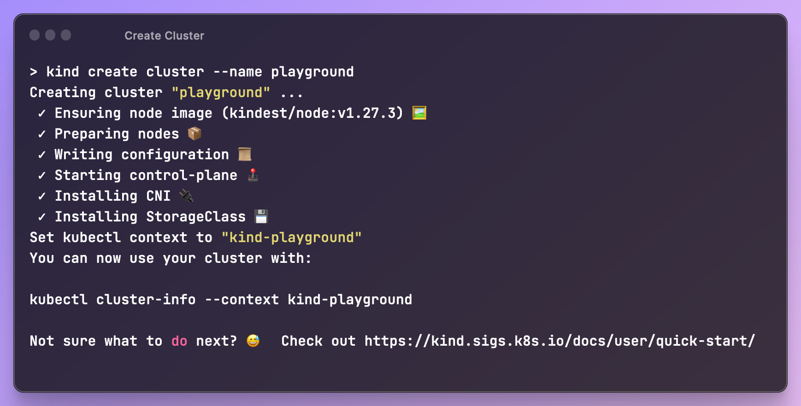
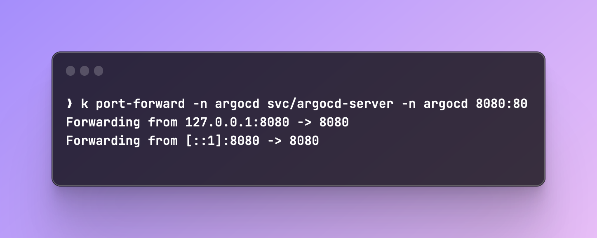
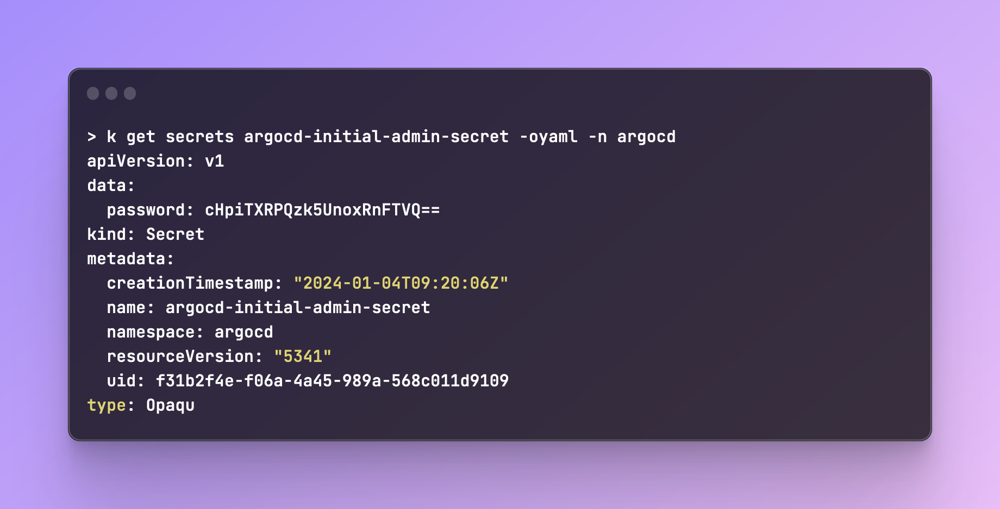
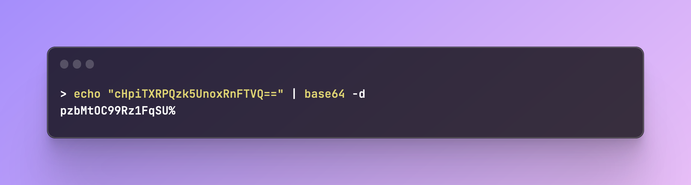

# Setup ArgoCD Locally
In many cases you find yourself testing things in local environments, whether it's scripts or workflows, you need a safe space to break things and learn.

ArgoCD is no exception, and while ArgoCD is native to Kubernetes, you don't need to spend money by running clusters in some cloud. I'll be using [KinD](https://kind.sigs.k8s.io/) to create a cluster on my laptop and install everything we need.

## Introduction
We will use 2 repos:
- Orangutan-infra - Will manage the infrastructure.
- Orangutan - Will manage the configuration files.

## Installation
### Create Kubernetes Cluster
1. Create a cluster: `kind create cluster --name playground`

You can run `kubectl get nodes` to make sure the control-plane is running.

### Preparing The Files
We'll use Terraform to install ArgoCD. We'll utilize Terraform's Helm provider to install ArgoCD instead of directly applying the chart on our cluster.

Before installing the Helm chart, you can run `helm search repo argocd` to search for the chart:

!!! note
      You can run `helm show values argo/argo-cd > argo-default-values.yaml` to export the default values of the chart. It's helpful when you want to see what values exist for each chart before deploying it.

1. In `orangutan-infra` I'll create the following folders and files:
```
└── terraform
    └── argocd
        ├── 0-provider.tf
        ├── 1-argocd.tf
        └── values
            └── argocd.yaml
```
For our values file `argocd.yaml`, we'll pass the following:
```yaml
---
server:
  extraArgs:
    - --insecure
```
`--insecure` will serve our UI on HTTP.

#### `0-provider.tf`
We'll configure Helm as our provider and pass `~/.kube/config` to use the local cluster we created:
```terraform
provider "helm" {
  kubernetes {
    config_path = "~/.kube/config"
  }
}
```

#### `1-argocd.tf`
For the Helm installation, we'll use the the following block:
```terraform
resource "helm_release" "argocd" {
  name = "argocd"

  repository       = "https://argoproj.github.io/argo-helm"
  chart            = "argo-cd"
  namespace        = "argocd"
  create_namespace = true

  values = [file("values/argocd.yaml")]
}
```

### Installing ArgoCD
1. Run `terraform init` to initialize Terraform. If it was successful, you should see the following output:
   1. We're ready to run `terraform apply`. If we did everything correctly, the output will show us the resources that we're deploying. Enter `yes` and wait for ArgoCD to finish installing.

   1. If all went well, you should be able to see our pods are in `Running` state:
      

!!! tip
      You can run `helm status argocd -n argocd` to follow the deployment status:
      

### Accessing ArgoCD
1. We need to port forward the Argo Server in order to access it:
   
2. Go to `http://localhost:8080`. You'll need to enter a username and password.
   By default, the username is `admin`.
   To get the password, we'll need to first fetch the secret that Argo created in our cluster:
   ```shell
   k get secrets argocd-initial-admin-secret -oyaml -n argocd
   ```
   
   The password is base64 encrypted. Let's decrypt it (don't copy the `%` char, it just states the end of the string):
   
3. Login to Argo's UI and change your password
   

That's it, you successfully installed ArgoCD locally ✅

