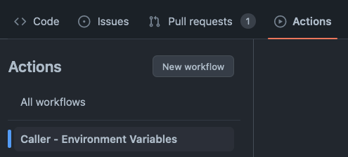

# How To Use Custom Environment Variables From Reusable Workflow
Let's go over how we can use custom environment variables when working with reusable workflow.
This is specifically helpful when you want to pass env variables to your caller workflow without adding more and more parameters to your workflow.

## Background
When we want to pass parameters between reusable workflows, you'd typically create an input for each variable that you want, for example:
```yaml
name: Workflow
on:
  workflow_call:
    inputs:
      var1:
        required: false
        type: string
      var2:
        required: true
        type: string
```

You would then reference these parameters in your caller workflow, for example:
```yaml
- uses: some-action
  with:
    var1: ${{ inputs.var1 }}
    var2: ${{ inputs.var2 }}
```
When you want to pass multiple vars, you would then have to create more inputs. This can cause you to chase after other caller workflows and adjust their existing configuration which in the end is kind of tedious work.

## Alernative
We can consolidate the custom environment variables into a single parameter, like so: 
```yaml
name: Reusable - Environment Variables
on:
  workflow_call:
    inputs:
      env_vars:
        description: "Environment variable"
        required: false
        type: string
jobs:
  build:
    runs-on: ubuntu-latest
    steps:
      - uses: actions/checkout@v4

      - name: Parse and set environment variables
        run: |
          env_vars=(${{ inputs.env_vars }})
          for var in ${env_vars[*]}; do
            echo $var >> "$GITHUB_ENV"
          done

      - name: Print environment variables
        run: |
          env
```

Then, in the caller workflow we can use the following step:
```yaml
name: Caller - Environment Variables

on:
  workflow_dispatch:

jobs:
  call-reusable-workflow:
    name: call-reusable-workflow
    uses: dbeilin/PrimateCI/.github/workflows/env_reusable.yml@main
    with:
      env_vars: |
        foo=bar
        waldo=fred
```

### Result
Let's call the above workflows:

  
  

The workflow finished successfully:


If we look through all of the environment variables, we'll find our custom ones:


That's it. I believe this is a pretty neat trick that can be useful some for use-cases.
