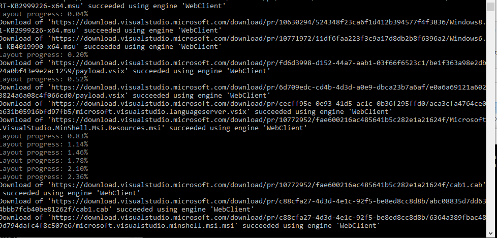
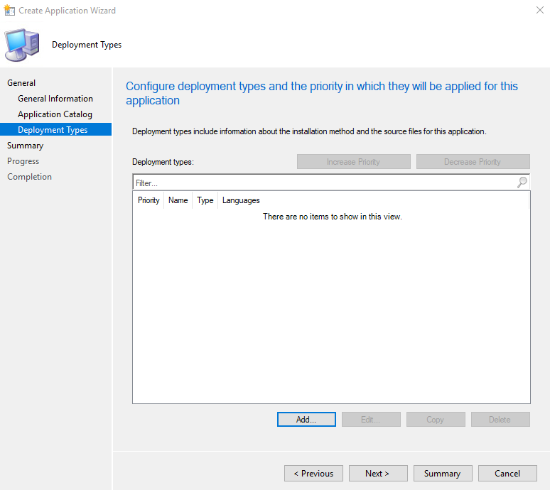
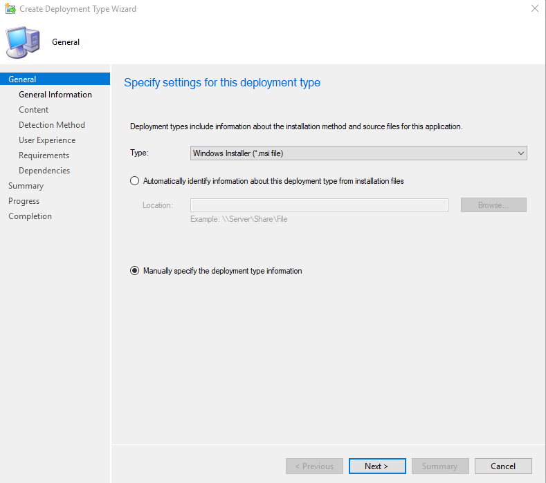
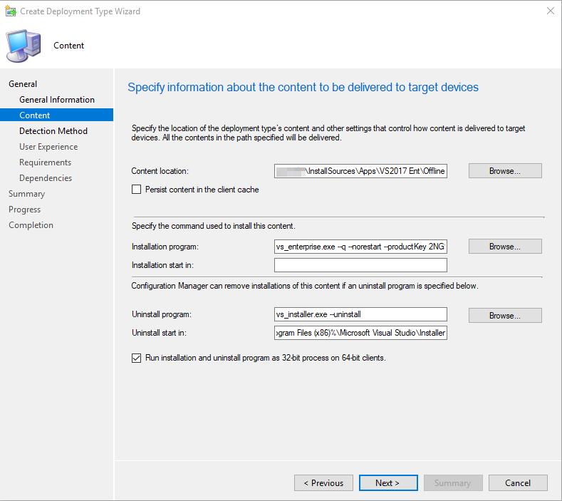

In this tutorial, we’ll go through deploying VS17 in SCCM.

Download the installer and save it under a folder of your choice. For this tutorial I’ll use `C:\VS17`


Open CMD and use -layout command of your choice.
My command:
```
vs_enterprise.exe --layout c:\vslayout --add
Microsoft.VisualStudio.Workload.ManagedDesktop --add
Microsoft.VisualStudio.Workload.NetWeb --add
Component.GitHub.VisualStudio --includeOptional --lang en-US
```

!!! info inline "More VS Components"

    Add components as you please, the list can be found [here](https://docs.microsoft.com/en-us/visualstudio/install/create-an-offline-installation-of-visual-studio?view=vs-2017).

!!! note inline
    the full featured installation requires about 40GB of free space. 


It will now download all the necessary files to the folder.


!!! tip
    Grab some coffee, it can take a while




Copy all the files to your SCCM server and let’s create a new App to deploy.






Point to the offline files we downloaded earlier as the “content location”.

For the installation command we’ll use the same command we used for the `–layout` command earlier when we downloaded the files offline. Just add your desired switches to the installation.

!!! note inline end
    - Add `–productKey` to use your license
    - More information on [switches](https://docs.microsoft.com/en-us/visualstudio/install/use-command-line-parameters-to-install-visual-studio?view=vs-2019).
```
Installation Program: vs_enterprise.exe --add
Microsoft.VisualStudio.Workload.ManagedDesktop --add
Microsoft.VisualStudio.Workload.NetWeb --add
Component.GitHub.VisualStudio --includeOptional --quiet --wait --norestart --productKey XXXXXXXXXXXXXXXXXXXX
```

---

!!! tip inline end
    Uninstall: `vs_enterprise.exe --uninstall`



I personally only use file detection as the discovery method.
Use the path to the default installation folder and search for `devenv.exe`

Path: `%ProgramFiles(x86)%\Microsoft Visual Studio\2017\Enterprise\Common7\IDE`


That’s it. Deploy and test to see if it works.

???+ tip
    - Don’t forget to to distribute to your DP.
    - You can improve this deployment by adding another detection method for the VS version you’re installing.
    - You can also add dependencies for this to be installed if you’re deploying outside of your task sequence.

Good luck 🙂
