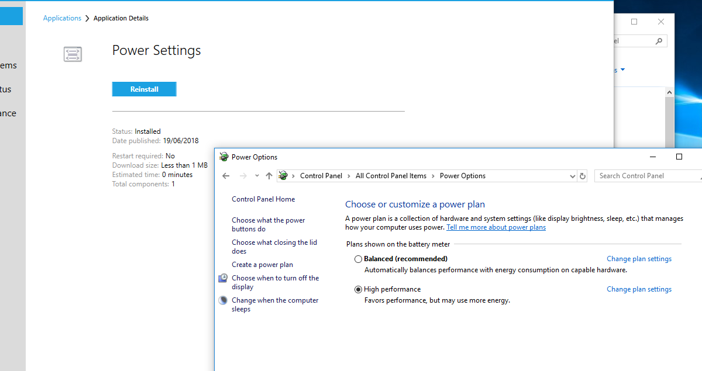
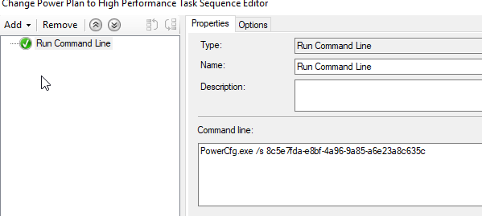

In this guide I’ll show you how to set the Power Plan of Windows to High Performance during the OSD.

This is good for one main reason: Speed up the deployment time. It seems that after some tests, this can speed up the OSD by 20-50% (depending on the environment and the deployment).

First, create a new “Run Command Line” step.

In the command line add this:

```
PowerCfg.exe /s 8c5e7fda-e8bf-4a96-9a85-a6e23a8c635c
```


???+ note

    Every power plan has it’s own GUID. If you wish to set it back to something else, simply choose your GUID and implement it later in the TS.

| Mode      | Description                          | GUID    |
| ----------- | ------------------------------------ |  ------------ |
| `Power Saver`       | Delivers reduced performance which may increase power savings.   | `a1841308-3541-4fab-bc81-f71556f20b4a` |
| `Balanced`       | Automatically balances performance and power consumption according to demand.  | `381b4222-f694-41f0-9685-ff5bb260df2e` |
| `High Performance`    | Delivers maximum performance at the expense of higher power consumption.  | `8c5e7fda-e8bf-4a96-9a85-a6e23a8c635c` |

Under the Options tab, create a TS Variable like this:


Now, I also added this power plan to take affect during WinPE as well like this:

```
X:\Windows\System32\PowerCfg.exe /s 8c5e7fda-e8bf-4a96-9a85-a6e23a8c635c
```


For testing purposes, I created a TS for this alone:



Deploying it to my machine worked great:


That's it, hope it helps someone 😊
