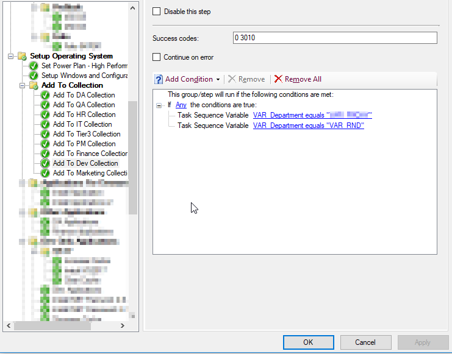

If you’re looking to organize new computers that you deploy, then this might be helpful.

First, save the following code as `AddMeToCollection.vbs`

```
'==========================================================================
 '
 ' NAME: AddMeToCollection.vbs
 ' 
 ' AUTHOR: Vinay, Microsoft
 ' DATE  : 8/7/2010
 '
 ' COMMENT: Script to add Unknown Computer to a specified collection during OSD
 ' USAGE: cscript AddMeToCollection.vbs   %_SMSTSClientIdentity%
 '==========================================================================
 On Error Resume Next
 Dim arrArguments
 Set arrArguments = WScript.Arguments
 If arrArguments.Count <> 3 Then
     WScript.Echo "Usage: cscript AddMeToCollection.vbs   %_SMSTSClientIdentity%"
     WScript.Echo " and  needs to be specified, but last parameter needs to be used as is."
     WScript.Quit
 End If
 Dim strServer, strCollID, strProvNamespace
 Dim strComputerName, strGUID, strResourceID
 Dim strUser, strPassword
 strResourceID = 0
 strServer = arrArguments(0)
 strCollID = arrArguments(1)
 strGUID = arrArguments(2)
 WScript.Echo ""
 WScript.Echo "==================================="
 WScript.Echo "   ADDING COMPUTER TO COLLECTION"
 WScript.Echo "==================================="
 WScript.Echo "Site Server specified: " & strServer
 WScript.Echo "Collection ID specified: " & strCollID
 WScript.Echo "SMS Client " & strGUID
 'Get the computer name
 Set oNet = CreateObject("WScript.Network")
 strComputerName = oNet.ComputerName
 WScript.Echo "Computer Name: " & strComputerName
 Set oNet = Nothing
 'Connect to root/sms namespace on SMS Site Server to find the Provider Namespace
 Set objLocator = CreateObject("WbemScripting.SWbemLocator")    
 Set oWbem = objLocator.ConnectServer(strServer, "root/sms")  
 If Err.number <> 0 Then
     WScript.Echo "Error connecting to root\sms namespace to find Provider Location. Exiting!"
     WScript.Echo "Error = " & Err.number & " - " & Err.Description
     WScript.Quit
 End If
 Set colNameSpace = oWbem.ExecQuery("SELECT * FROM SMS_ProviderLocation")
 For Each item in colNameSpace
        WScript.Echo "SMS Provider Namespace = " & item.NamespacePath
     strProvNamespace = item.NamespacePath
 Next
 'Connect to the Provider Namespace
 Set oWbem = objLocator.ConnectServer(strServer, strProvNamespace)
 If Err.number <> 0 Then
     WScript.Echo "Error connecting to SMS Provider namespace. Exiting!"
     WScript.Echo "Error = " & Err.number & " - " & Err.Description
     WScript.Quit
 Else
     WScript.Echo "Successfully Connected to the SMS Provider Namespace"
 End If
 'Find out the Resource ID of the computer by querying SMS_R_System Class against the SMS GUID
 Set colResources = oWbem.ExecQuery("SELECT ResourceID FROM SMS_R_System WHERE SMSUniqueIdentifier = '" & strGUID & "'")
 For Each oResource In colResources
     strResourceID = oResource.ResourceID
     WScript.Echo "Resource ID = " & strResourceID
 Next
 'If Resource ID was not found, exit gracefully
 If strResourceID = 0 Then
     WScript.Echo "Could not find the Resource ID for the computer. Exiting!"
     WScript.Quit
 End If
 'Verify if the specified collection exists
 Set oCollection = oWbem.Get("SMS_Collection.CollectionID=" & """" & strCollID & """")
 If oCollection.Name = "" Then
     WScript.Echo "Specified Collection (" & strCollID & ") was Not Found. Exiting!"
     WScript.Quit
 End If
 'Create a Direct Membership rule
 Set oDirectRule = oWbem.Get("SMS_CollectionRuleDirect").SpawnInstance_ ()
 oDirectRule.ResourceClassName = "SMS_R_System"
 oDirectRule.ResourceID = strResourceID
 oDirectRule.RuleName = strComputerName & " - SMSTS"
 'Add the Direct Membership Rule to the specified collection
 oCollection.AddMembershipRule oDirectRule
 If Err.Number <> 0 Then
     WScript.Echo "Could not add the computer to the specified collection. Exiting!"
     WScript.Echo "Error = " & Err.number & " - " & Err.Description
     WScript.Quit
 Else
     WScript.Echo strComputerName & " successfully added To " & strCollID
 End If
 WScript.Echo "==================================="
 WScript.Echo ""
 Set objLocator = Nothing
 Set oWbem = Nothing
 Set oCollection = Nothing
 Set oDirectRule = Nothing
 'End Script
```

Move it to a folder in your SCCM server and create a new package.


Now go to your Task Sequence and add a command line


Add the following command:
```
cscript AddMeToCollection.vbs sccm.server.com XX100028 %_SMSTSClientIdentity%
```

- Where `sccm.server.com` is, replace it with your SCCM server.
- For `XX1000E1`, replace it with the collection’s ID.


I personally had to use a privileged account for it to work. I apply this after the client is installed, and from my testing, it failed without admin rights. As always, your mileage may vary.

### How it can be used

This script can be super useful in environments where you deploy all kinds of image versions for different departments. For example, I use TsGui and created an XML GUI to choose which customization to apply to the image using variables.
This script helped me add the device I’m imaging to the correct collection because I configure each department separately, as can be seen here:




???+ note

    In my environment, the new device appears as “Unknown” fora while (15-30 minutes) but eventually gets the correct hostname.

Hope this has been useful to you 🙂
