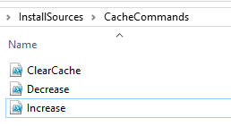

Resizing or clearing cache can be useful for many things. In this tutorial I’ll show you how I do it during my Task Sequence. I personally needed it to install Visual Studio during OSD. The default size is 5120MB which is not enough in my case.

### Resize Cache Size
```
$UIResourceMgr = New-Object -ComObject UIResource.UIResourceMgr
 $Cache = $UIResourceMgr.GetCacheInfo()
 $Cache.TotalSize = 25600
```

### Clear Cache
```
$UIResourceMgr = New-Object -ComObject UIResource.UIResourceMgr
 $Cache = $UIResourceMgr.GetCacheInfo()
 $CacheElements = $Cache.GetCacheElements()
 foreach ($Element in $CacheElements) {
     $Cache.DeleteCacheElement($Element.CacheElementID)
 }
```

Save them all as .ps1 files and place in the same folder.



Create a package, without a program, and don’t forget to distribute it to your DP.


Now you can use it as a regular PS1 script in your TS as so:


For my TS, I increase the cache size, install all the software I need, clear it and then decrease it back to the default setting, since I don’t want it taking too much space on the hard drive.

Hope this has been helpful in some way 🙂