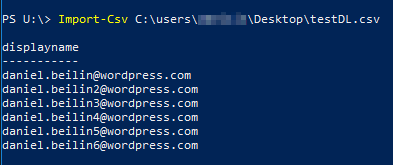

If you need to add multiple users to a distribution group in Office 365, you’ll find out using the GUI can take a lot of time.
Luckily, it only takes a CSV file and one line of code to do this automatically.

First, save a CSV file with the email addresses you need, and make sure the first line is `displayname`.


First, test if PowerShell reads your CSV correctly as so:



If your output looks like the image above, then you’re good to go.
The command you need to run to add the users to the distribution list is:

```powershell
Import-Csv $Location | foreach {Add-DistributionGroupMember -Identity "Name of DL" -Member $_.displayname}
```

For `$Location`, just type the path to the `.csv` file. It doesn’t have to be a variable of course.
For the `-Identity`, use the name of the group you want to add the users to.

That’s it. Hope this will be useful to someone 🙂