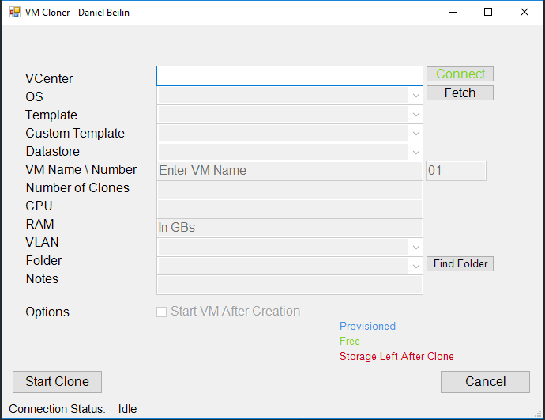

VM Cloner is just a hobby project I wrote to allow myself to clone VMs in our vSphere environment.

This script is pretty customized to my needs. Since every work environment is different, I'd make sure to read everything below and figure out if it suits you. This is my very first GUI project for Powershell. I can tell in advance that it's not perfect, but it's working. Any feedback is always welcome. Use this with caution, as always, your millage may vary.

[Github Link](https://github.com/Beinish/VMware-VM-Cloner)